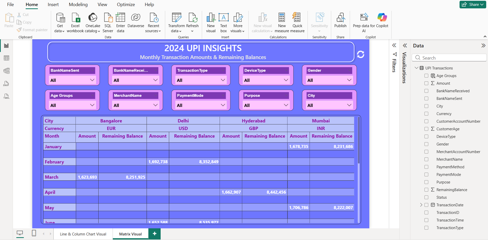

# UPI Transactions & Digital Payments Analysis Dashboard 📱

## 1. Overview
Developed an interactive Power BI dashboard to analyze high-volume, unstructured UPI transaction data. The project's core challenge was engineering a reliable pipeline to clean and categorize messy merchant/transaction descriptions into structured, analytical formats.

---

## 🖼️ Transaction Trends and Volume Analysis
This primary visual section captures the macro trends in UPI adoption. It tracks the growth of both **transaction volume** (count) and **transaction value** (total currency exchanged) over defined time periods, essential for understanding market saturation and growth acceleration.

****

---

## 2. Comparative Analysis and Segmentation Matrix
The core of this analysis is breaking down aggregate performance into actionable segments. The matrix visual provides a detailed, sortable comparison of key metrics (e.g., Average Transaction Value, Volume Share) across critical dimensions, such as:

* **Geographic Region (State/City)**
* **Payment Type (P2P vs. P2M)**
* **User Demographics/Age Group**

****

---

### 🎯 Goal
To provide clear insights into transaction volume, value trends, P2P (Person-to-Person) vs. P2M (Person-to-Merchant) split, and peak platform usage times, allowing for optimization of platform performance and marketing.

## 2. Tools & Technologies
- **Business Intelligence:** Microsoft Power BI
- **ETL/Data Cleaning:** **Power Query (M Language)** for advanced string manipulation, conditioning, and pattern matching.
- **Analysis:** Time Series Analysis, Payment Flow Categorization.
- **Data Source:** Raw UPI transaction statements (high volume, unstructured text).

## 3. Key Actions / Process (The ETL Challenge)
- **Unstructured Data Cleaning:** Used **Power Query's M language** to extract dates, amounts, and transaction types from inconsistent, lengthy text descriptions (a critical step for UPI data).
- **Categorization Logic:** Implemented **Conditional Logic and Fuzzy Matching** within Power Query to map thousands of unique merchant names (e.g., 'Amazon', 'AMZN', 'Amzn') into standardized categories.
- **Payment Flow Metrics:** Developed DAX measures to calculate:
    - **Total Transaction Count** & **Total Transaction Value**
    - **P2P vs P2M Volume & Value Ratio**
    - **Daily/Hourly Peak Transaction Count**
- **Visualization:** Created heat maps and time-series charts to visualize peak usage hours and days, identifying potential areas for infrastructure scaling.

## 4. Key Achievements & Results
- **Data Transformation:** Successfully engineered a scalable **Power Query solution** to clean data that previously required hours of manual spreadsheet work, proving advanced ETL proficiency.
- **Actionable Insights:** Identified key merchant and vendor relationships, providing a clear breakdown of where platform transaction volume originates.
- **Trend Visibility:** Provided clear visibility into the **growth rate of digital payments** and the shift between P2P and P2M transactions over time.

## 5. View Project
- **Live Interactive Dashboard:** [Insert Your NovyPro or Tableau Public Link HERE]
- **Source File:** UPIDataPBI.pbix (Available in this repository)
